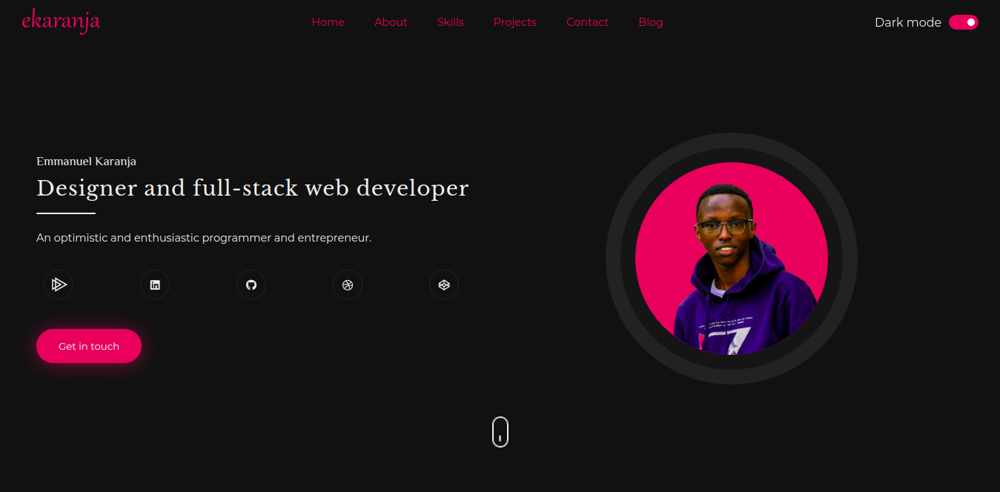

  
  <h1>ekaranja</h1>
  

# Set up

Install all the `npm` dependencies
`npm install`

## Gulp commands

> Make sure you have `gulp cli` installed globally `npm i -g gulp-cli`

| Comand          | Action                                                           |
| --------------- | ---------------------------------------------------------------- |
| `gulp pages`    | Generates all pages based on `gulp-panini` package               |
| `gulp style`    | Compiles all your `scss` files to `css` and minifies them        |
| `gulp js`       | Compiles all your `es6` code to `es5` and minifies it            |
| `gulp minimage` | Minifies all images in the `/src/lib/images` directory           |
| `gulp minifile` | Compiles all files in the `/src` directory                       |
| `gulp hashify`  | Adds hashes to js and css files for cache purposes               |
| `gulp hashify2` | Adds hashes to js and css files for cache purposes               |
| `gulp watch`    | Watches for all the above in `/public` directory and hot reloads |

> _PS: The `/src/data/data.yml` is your single source of truth_

Made with 💛 by Me, using node v14, gulp v4.14

